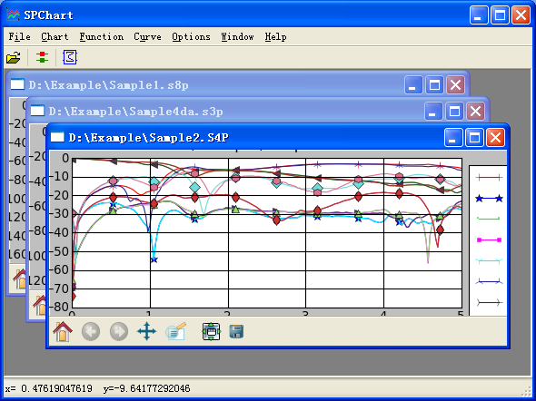

.. SPChart Homepage documentation master file, created by
   sphinx-quickstart on Sat Feb 12 13:08:44 2011.
   You can adapt this file completely to your liking, but it should at least
   contain the root `toctree` directive.

===========================
Welcome to SPChart Homepage
===========================

SPChart Overview
================
SPChart is free software to plot S-paramters. The motivation of developing
this software is that I cannot find a free tools to do such things.

SPchart is still under developing and now it has such features:

* support SnP files from S1P upto S9P
* only support 4 port mixed mode s-paramters
* export chart to eps, emf, pdf, png, ps, svg format
* phase functions
* TDR(not applied in this version)

Pre-requirement
===============
SPChart is base on Python, Numpy and Matplotlib. It is also compiled to
exe file by py2exe and packaged to a insaller by Inno Setup.

If you want run SPChart as python script, please install python, numpy and
matplotlib first, I recommand to use Python(x,y) package with everthing
together. Otherwise, you can use compiled exe format without any libarays
pre-installed.

SPChart was developed and tested on Windows XP platform only.

Evaluate the accuracy
=====================
SPview is commercial(not-free) software, can be use to compare with SPChart.
`Sample S4P file download.`_

.. _Sample S4P file download.: _static/Sample2.S4P

Single Mode
-----------
Plot the magnitude in dB:

* SPChart curves

    .. image::  _static/SPChart_SEmode.png

* SPview curves

    .. image::  _static/SPView_SEmode.png

Mixed Mode
----------
Caculate from single-ended s-paramters, plot the magnitude in dB:

* SPChart curves

    .. image::  _static/SPChart_mixmode.png

* SPview curves

    .. image::  _static/SPView_mixmode.png

Indices and tables
==================

* :ref:`genindex`
* :ref:`modindex`
* :ref:`search`

